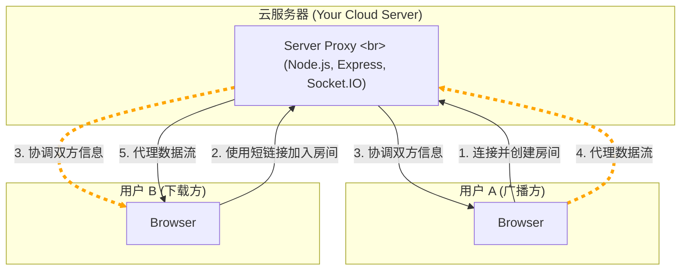

# P2P 文件共享 (P2P File Share)


一个基于 Socket.IO 的实时、私密、无服务存储的文件共享应用。通过服务器代理模式进行文件传输，确保在各种网络环境下的稳定连接。

### ✨ 核心特性

*   **稳定传输模式**: 使用 Socket.IO 服务器代理传输，确保在各种网络环境下都能成功传输文件。
*   **隐私与安全**: 服务器不存储任何文件内容，仅作数据中转。
*   **无上限文件大小**: 对于单个文件传输，采用流式写入 ([StreamSaver.js](https://github.com/jimmywarting/StreamSaver.js))，理论上没有文件大小限制，不会耗尽浏览器内存。
*   **多文件与文件夹支持**: 支持一次性拖拽或选择多个文件甚至整个文件夹进行分享。
*   **自动打包**: 当分享多个文件时，接收方会自动将所有文件打包成一个 `.zip` 压缩包进行下载。
*   **现代化用户体验**: 简洁的拖拽式 UI，通过一个简单的短链接即可分享。
*   **断线重连**: 广播方断开连接后，在宽限期内重连可继续传输，无需重新开始。

### 🚀 架构解析

本应用采用基于 Socket.IO 的服务器代理传输架构，确保在各种复杂网络环境下的稳定传输。



*   **服务器代理模式**: 客户端通过 Socket.IO 连接服务器，文件数据通过服务器中转传输。这种方式牺牲了服务器带宽，但保证了 100% 的连接成功率。

### 🛠️ 技术栈

*   **后端**:
    *   **Node.js**: JavaScript 运行时环境。
    *   **Express**: Web 框架，用于提供静态页面。
    *   **Socket.IO**: 用于实现代理数据传输和房间管理。
    *   **nanoid**: 用于生成唯一的短链接 ID。

*   **前端**:
    *   **HTML5 / CSS3 / JavaScript (ES6+)**: 应用基础。
    *   **Socket.IO Client**: 与后端进行实时通信。
    *   **JSZip**: 用于在客户端打包多个文件为 `.zip`。
    *   **StreamSaver.js**: 实现大文件流式写入，避免浏览器内存崩溃。

### 🏁 开始使用

#### 先决条件

*   Node.js (v16 或更高版本)
*   npm

#### 安装与运行

1.  **克隆仓库**
     ```bash
    git clone https://github.com/lmzmm/DropSharer.git
    cd DropSharer
    ```

2.  **安装依赖**
    ```bash
    npm install
    ```

3.  **启动服务器**
    ```bash
    npm start
    ```

4.  **访问应用**
    在您的浏览器中打开 `http://localhost:3000` 即可开始使用。

### 部署到服务器

1.  将项目文件上传到您的云服务器。
2.  按照上述步骤安装依赖并启动服务。
3.  **关键**: 确保您的服务器**防火墙/安全组**已开放以下端口：
    *   `TCP 3000` (或您在 `server.js` 中指定的其他端口)
4.  使用 `pm2` 或其他进程管理工具来保持 Node.js 应用在后台持续运行。
5.  通过服务器的公网 IP 地址访问您的应用：`http://[你的服务器公网IP]:3000`

### 📜 开源许可

本项目采用 [MIT License](LICENSE) 开源许可。